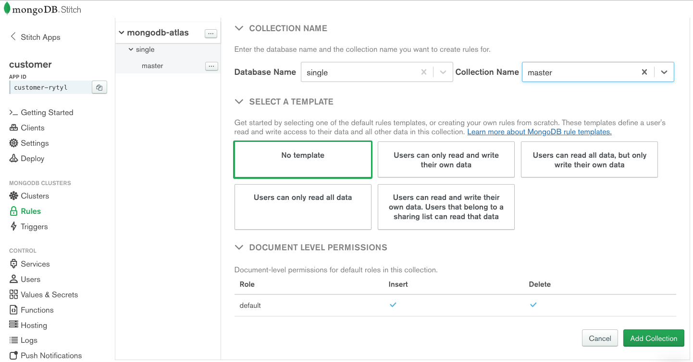
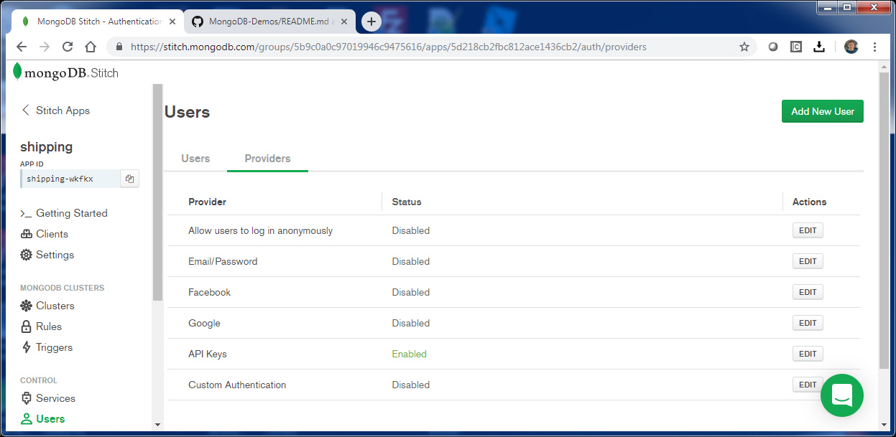
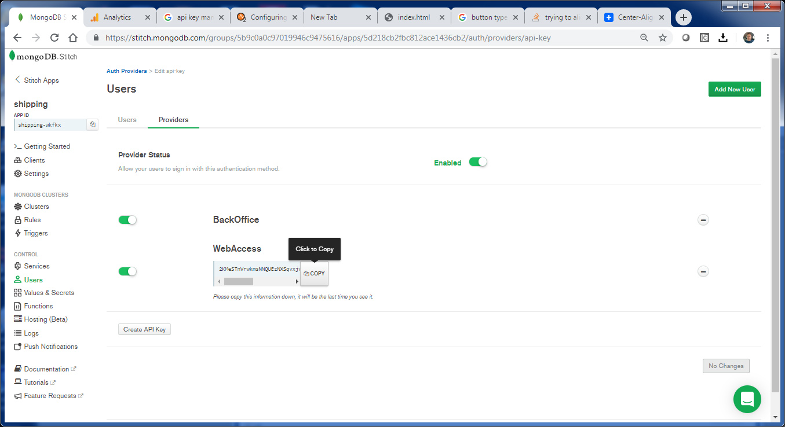
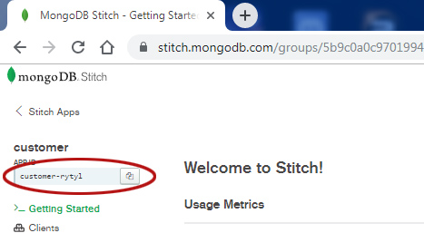
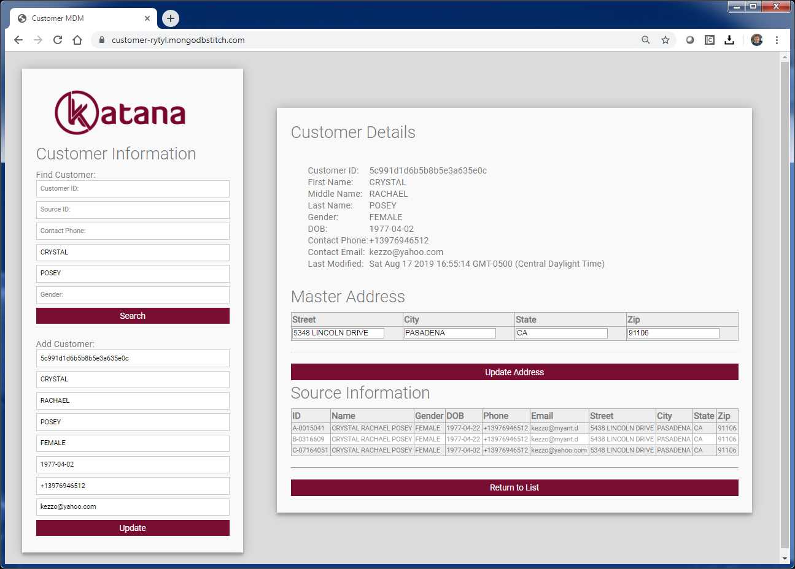
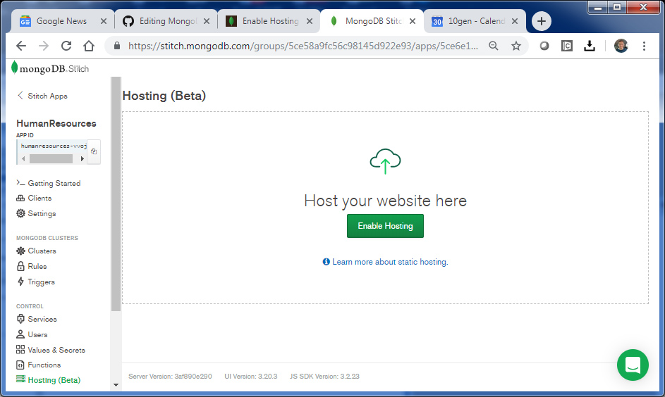
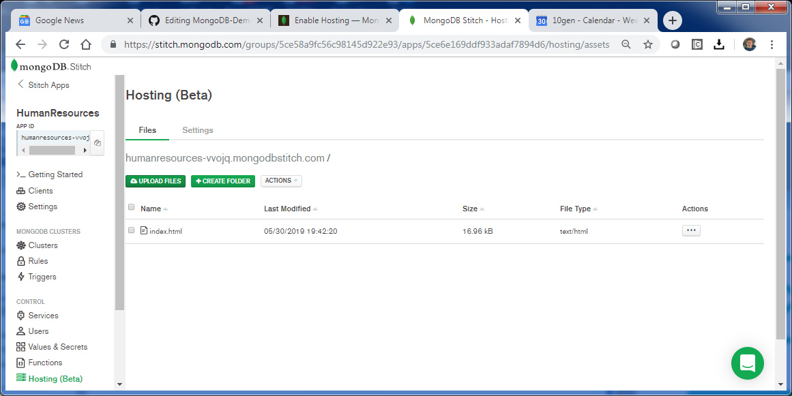
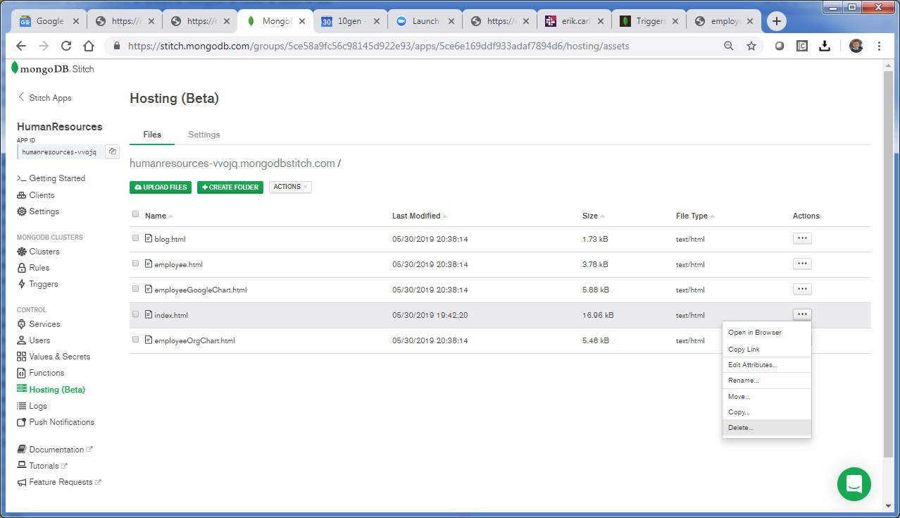

# Hosting the Back Office Application

_SA Maintainer_: [Britton LaRoche](mailto:britton.laroche@mongodb.com)

## Part 1 QueryAnywhere
In this section, we will cover QueryAnywhere through the Stitch browser SDK.  We will use Mongo Query Language (MQL) directly against the database.  

### 1. Applying Rules
Before a client application can access a collection via the stitch browser SDK access to the underlying collections must be granted to the stitch application through the rules interface. 

We need to grant access to the __master__ collection in the __single__ database.   

   

Select the __"Rules"__ menu item from the left hand navigation pane in the stitch console window.  Click the __mongodb-atlas__ icon button __...__ and select "Add Database Collection" 

Enter __single__ for the database name and __master__ for the collection.  Select __"No template"__ and click save.  



We can edit the rules generated at a future point in time to limit what data we will have access to through and API Key.  Generating an API Key creates a default user to go with the key.

### 2. Create an API key
We begin by adding a bit of security and creating an API Key and associated user permissions.  This is not necessary as we could create an anonymous user, use a third-party authentication method (facebook, google, AWS Cognito, JWT etc..)  Let us quickly explore our options.  Click on the __"Users"__ menu item in the left-hand navigation panel in the stitch console.  The user's window will display a list of users (we have not created any). Let's click the provider's tab at the top of the user's window.  We are presented with a list of options as seen below.



Third-party providers such as facebook and google provide an excellent way for customers to access data and will be covered at a point in the future.  For now explore the custom option as you can see how to integrate with a Single Sign-On (SSO) provider like AWS Cognito, or something you are using in house through Java Web Tokens (JWT) as this eliminates the headache of user management for your application.

For now, we will generate an API Key.  Select the __"API Keys"__ option and click the edit button.



Type in a name for the API Key, something like "BackOffice" or "WebAccess" and click save.  A private key will be displayed.  Copy that key and paste it into a text editor of your choice.  Then create the API key.  We will use that key to access the database through the stitch browser SDK.

### 3. Create the browser client application
You will need a text editor for this section. If you do not have a text editor we recommend downloading a free text editor from one of the following sites (VS Code is best for Developers):

[Notepad ++](https://notepad-plus-plus.org/download)   
[Brackets](http://brackets.io/)   
[VS Code](https://code.visualstudio.com/)   

The MongoDB stitch browser client SDK documentation is in this link here [MongoDB Stitch Browser SDK](https://docs.mongodb.com/stitch-sdks/js/4/index.html)  At the time of the writing of this tutorial we are on SDK version 4.9.0 

Navigate to the top section of this git hub or (right click "open in new tab") the link [Single-View](https://github.com/10gen/single-view).  

Press the green box "Clone or Download" and select "Download Zip File" if you have not already.  Extract the zip file and navigate to the (unzip path)MongoDB-Demos/Applications/Customer/html directory.  Here you will find the HTML file CSS file and images for our sample customer single view application.  Alternatively you can view and copy the HTML and CSS files from the html subdirectory of this readme (right-click "open in new tab") [here](https://github.com/10gen/single-view/blob/master/stitch/single-view/hosted/html).

Open the index.html file in the editor and replace 'your-app-id' with the application id of your customer single view application and the 'your-api-Key' with the API key we just generated.  The APP-ID is located in the upper left of the stitch console as seen below, click the copy button to load it in your clipboard for a quick paste.



```js
      const credential = new stitch.UserApiKeyCredential('your-api-key');
      const client = stitch.Stitch.initializeDefaultAppClient('your-app-id');
```

should look like 

```js
      const credential = new stitch.UserApiKeyCredential("y2yhO49BDf4zvQVnt5GEC0Ge90VJVsByuSGVVJAvUr4Z9tZjWvJ2iZiL8OhKKY9M");
      const client = stitch.Stitch.initializeDefaultAppClient('customer-rytyl');
```

__Important Note:__ Pasting the API key directly into the HTML source code is a bad idea.  There are a number of ways to properly manage an API Key, and this is not one of them.  We highly recommend hiding and accessing this key according to best practices.  Unfortunately, we don't have access to any of these best-practice methods in this tutorial.  Just make a mental note that long term the API Key needs to be managed outside of the HTML source code and according to your organization's best practices.

Save the index.html and double click it.  You should see something like this:   

   
The live prototype with 2,000,000 sample records is hosted in Stitch and can be accessed here:   
https://single-view-iblcf.mongodbstitch.com/

The magic happens in this line below.  Here we include the stitch SDK that turns the browser into a Stitch client.  All of the Stitch functions that allow us to connect to the database, query and manipulate data are made available by the source link in the index.html file below.
```js
 <script src="https://s3.amazonaws.com/stitch-sdks/js/bundles/4.9.0/stitch.js"></script>
```
Now that we have included the stitch SDK we can establish a connection to the database and authenticate.  Our example is provided below:

```js
        const credential = new stitch.UserApiKeyCredential("pC4Zh114GuVouc9DDBGO0UeZlIpo7UppPuzQJwBfThapugCViKBs0I4xFdUIBwbc");
        const client = stitch.Stitch.initializeDefaultAppClient('customer-rytyl');
        const db = client.getServiceClient(stitch.RemoteMongoClient.factory,"mongodb-atlas").db('single');
        function displayCustomersOnLoad() {
          client.auth
            .loginWithCredential(credential)
            .then(displayCustomers)
            .catch(console.error);
        }
	
```

note that the service name is the one you specify, the default is __"mongodb-atlas"__

```js
const db = client.getServiceClient(stitch.RemoteMongoClient.factory,"mongodb-atlas").db('single');
```

The one specified in this project was __"single-atlas"__

```js
onst db = client.getServiceClient(stitch.RemoteMongoClient.factory,"single-atlas").db('single');
```

The database is specified here also, the database for the single view prject is named __"Single"__ 

Once connected to the datababse we can build our own search document based on user input. We pass that search document to a database find() function.  Then we loop through the results to build a dynamic HTML table as seen below:

```js
        function displayCustomers() {
          var searchDoc = {};
          var sCust = document.getElementById('s_customer_id'); 
          var sSource = document.getElementById('s_source_id'); 
          var sPhone = document.getElementById('s_contact_phone');
          var sFname = document.getElementById('s_fname');
          var sLname = document.getElementById('s_lname'); 
          var sGender = document.getElementById('s_gender'); 
          if ( sGender.value != "") {
            searchDoc["master.gender"] =  sGender.value; 
          }
          if ( sPhone.value != "") {
            searchDoc["master.phone"] = { $regex: new RegExp(sPhone.value) }; 
          }
          if ( sFname.value != "") {
            searchDoc["master.first_name"] = { $regex: new RegExp(sFname.value)}; 
          }
          if ( sLname.value != "") {
            searchDoc["master.last_name"] = { $regex: new RegExp(sLname.value)}; 
          }
          if ( sCust.value != "") {
            searchDoc._id = new stitch.BSON.ObjectId(sCust.value); 
          }
          if ( sSource.value != "") {
            searchDoc["sources._id"] = sSource.value; 
          }
          //alert(JSON.stringify(searchDoc));
          const tStrt = "<div><table class=\"blueTable\"><tr><th>ID</th><th>Name</th><th>Gender</th><th>DOB</th>" +
            "<th>Conact Phone</th><th>Email</th><th>Last Modified</th><th>Edit</th></tr>";
            db.collection('master').find(searchDoc, {limit: 42}).asArray()
              .then(docs => {
                const html = docs.map(c => "<tr>" +
                  "<td>" + c._id +  "</td>" +
                  "<td>" + c.master.first_name + " " + c.master.last_name + "</td>" +
                  "<td>" + c.master.gender + "</td>" + 
                  "<td>" + c.master.dob + "</td>" +
                  "<td>" + c.master.phone + "</td>" + 
                  "<td>" + c.master.email + "</td>" +
                  "<td>" + formatDate(c.last_modified) + "</td>" +
                  "<td>" +
                  "<button type=\"checkbox\" class=\"blueTable\"" +
                  "onClick=\"editCustomer(\'" + c._id +"\')\">" +
                  "<i class=\"material-icons\" style=\"font-size:18px\">" +
                  "mode_edit</i></button>" + 
                  "</td>" +
                  "</tr>").join("");
                document.getElementById("customers").innerHTML = tStrt + html + "</table></div>";
            });
          }
```

The rest of the HTML file manipulates the results from the database and transforming the various document arrays into rows and columns.  It allows the user to update the master document data as well.   

   

## Part 2 Host the web application

### Hosting Overview
Stitch Hosting allows you to host, manage, and serve your application’s static media and document files. You can use Hosting to store individual pieces of content or to upload and serve your entire client application. Stitch hosts your application’s content behind a unique domain name. By default, Stitch uses domains of the following form: ```<Your App ID>.mongodbstitch.com```. You can configure Stitch to host content at a custom domain name that you own in addition to the default hosting domain.

For further infromation read the [hosting documentaion](https://docs.mongodb.com/stitch/hosting/) for an overview. Its a two-step process to [enable hosting](https://docs.mongodb.com/stitch/hosting/enable-hosting/) and then [upload content](https://docs.mongodb.com/stitch/hosting/upload-content-to-stitch/). 

### 1. Enable hosting
Navigate to the Hosting Configuration Page:   
To open the hosting configuration page, click "Hosting" in the left-hand navigation of the Stitch UI.



On the Hosting configuration page, click Enable Hosting. Stitch will begin provisioning hosting for your application.  You can now access your default index page by typing in the following URL into your browser:

 ```<your-app-id>.mongodbstitch.com```
 

### 2. Upload your files


Press the button labeled __"upload your files"__ and select all the HTML files you have been working on.   

We will upload the files in this [html directory](../../html/)

__drop-down-arrow.png__   
__index.html__   
__loading.gif__   
__logo.png__   
__postrapper.html__   
__customer.css__   

Click the image files and right-click save as.  Edit the text files (HTML and CSS) and cut paste the contents then save the file with the correct name.  Alternatively, you can download the project as a zip file and navigate to (extract path)/single-view-master/stitch/single-view/hosted/html/

You can now access them at <your-app-id>..mongodbstitch.com!  For example, try   
  
 ```<your-app-id>.mongodbstitch.com/index.html```
 



Lets see your new employee app in action! Type in the default address 

 ```<your-app-id>.mongodbstitch.com```

Notice how you can access the database directly from the web.  __***Note:***__  you may need to select the  __"Actions"__ drop list in the hosting console and "Flush CDN Cache" and deploy the changes to view the updates.

We will upload the files in this [html directory](html/)   

[Tutorial Contents](#tutorial-contents)
   
